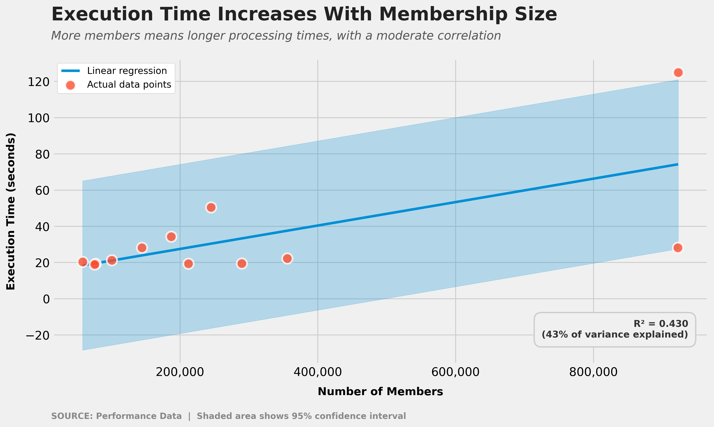

# HCCInFHIR

[](https://badge.fury.io/py/hccinfhir)
[](https://www.python.org/downloads/)
[](https://opensource.org/licenses/Apache-2.0)

A comprehensive Python library for calculating HCC (Hierarchical Condition Category) risk adjustment scores from healthcare claims data. Supports multiple data sources including FHIR resources, X12 837 claims, X12 834 enrollment files, and direct diagnosis processing.

## 🚀 Quick Start

```bash
pip install hccinfhir
```

```python
from hccinfhir import HCCInFHIR

processor = HCCInFHIR(model_name="CMS-HCC Model V28")

result = processor.calculate_from_diagnosis(["E11.9", "I10", "N18.3"], age=67, sex="F")
print(f"Risk Score: {result.risk_score}")
print(f"HCCs: {result.hcc_list}")
```

## 📋 Table of Contents

- [Migrating from hccpy](#migrating-from-hccpy)
- [Key Features](#key-features)
- [Data Sources & Use Cases](#data-sources--use-cases)
- [Installation](#installation)
- [How-To Guides](#how-to-guides)
  - [Working with CMS Encounter Data (837 Claims)](#working-with-cms-encounter-data-837-claims)
  - [Processing X12 834 Enrollment for Dual Eligibility](#processing-x12-834-enrollment-for-dual-eligibility)
  - [Processing Clearinghouse 837 Claims](#processing-clearinghouse-837-claims)
  - [Using CMS BCDA API Data](#using-cms-bcda-api-data)
  - [Direct Diagnosis Code Processing](#direct-diagnosis-code-processing)
- [Configuration](#configuration)
  - [Supported HCC Models](#supported-hcc-models)
  - [Custom Data Files](#custom-data-files)
  - [Demographics Configuration](#demographics-configuration)
- [API Reference](#api-reference)
- [Advanced Features](#advanced-features)
  - [Payment RAF Adjustments](#payment-raf-adjustments)
  - [Demographic Prefix Override](#demographic-prefix-override)
  - [Custom File Path Resolution](#custom-file-path-resolution)
  - [Batch Processing](#batch-processing)
  - [Large-Scale Processing with Databricks](#large-scale-processing-with-databricks)
  - [Converting to Dictionaries](#converting-to-dictionaries)
- [Sample Data](#sample-data)
- [Testing](#testing)
- [Comparison: CMS HHS-HCC Tool vs. hccinfhir](#comparison-cms-hhs-hcc-tool-vs-hccinfhir)
- [License](#license)

## 🔄 Migrating from hccpy

HCCInFHIR is the evolution of [hccpy](https://github.com/yubin-park/hccpy). If you're already using hccpy, the transition is straightforward:

**hccpy**:
```python
from hccpy.hcc import HCCEngine

he = HCCEngine("28")
rp = he.profile(["E1169", "I5030", "I509", "I211", "I209", "R05"], age=70, sex="M")
print(rp["risk_score"])
print(rp["hcc_lst"])
```

**hccinfhir**:
```python
from hccinfhir import HCCInFHIR

processor = HCCInFHIR(model_name="CMS-HCC Model V28")
result = processor.calculate_from_diagnosis(["E1169", "I5030", "I509", "I211", "I209", "R05"], age=70, sex="M")
print(result.risk_score)
print(result.hcc_list)
```

**Why upgrade?**

| | hccpy | hccinfhir |
|---|---|---|
| Diagnosis-to-RAF | Simple and fast | Same simplicity, same speed |
| Input formats | Diagnosis codes only | FHIR EOB, X12 837, X12 834, diagnosis codes |
| HCC models | V22, V24, V28, ESRD V21 | V22, V24, V28, ESRD V21, ESRD V24, RxHCC V08 |
| Dual eligibility | Manual `elig` parameter | Auto-detection from 834 enrollment data |
| Payment adjustments | CIF + normalization | MACI, normalization, frailty scores |
| Data quality | No workarounds | Prefix override for incorrect source data |
| Custom data files | Not supported | Full support for custom coefficients, mappings, hierarchies |
| Output | Dictionary | Pydantic model (typed, serializable, dict-convertible) |

**Key differences to note**:
- hccpy's `elig` parameter (e.g., `"CNA"`) maps to hccinfhir's `dual_elgbl_cd` — the library auto-detects the eligibility segment from demographic fields
- hccpy's `medicaid=True` maps to `dual_elgbl_cd="02"` (or other dual codes) in hccinfhir
- hccpy returns a dict; hccinfhir returns a `RAFResult` object (use `result.model_dump()` if you need a dict)

## ✨ Key Features

- **Multiple Input Formats**: FHIR EOB, X12 837, X12 834, direct diagnosis codes
- **Comprehensive HCC Models**: Support for CMS-HCC V22/V24/V28, ESRD models, RxHCC
- **Dual Eligibility Detection**: X12 834 parser with California DHCS Medi-Cal support
- **CMS Compliance**: Built-in filtering rules for eligible services
- **Payment RAF Adjustments**: MACI, normalization factors, frailty scores
- **Data Quality Workarounds**: Demographic prefix override for incorrect source data
- **Custom Data Files**: Full support for custom coefficients, mappings, and hierarchies
- **Flexible File Resolution**: Absolute paths, relative paths, or bundled data files
- **Type-Safe**: Built on Pydantic with full type hints
- **Well-Tested**: 238 comprehensive tests covering all features

## 📊 Data Sources & Use Cases

### 1. **X12 837 Claims (Professional & Institutional)**
- **Input**: X12 837 5010 transaction files + demographics
- **Use Case**: Medicare Advantage encounter data, health plan claims processing
- **Features**: Service-level extraction, CMS filtering, diagnosis pointer resolution
- **Output**: Risk scores with detailed HCC mappings and interactions

### 2. **X12 834 Enrollment Files**
- **Input**: X12 834 benefit enrollment transactions
- **Use Case**: Extract dual eligibility status, detect Medicaid coverage loss
- **Features**: California DHCS aid code mapping, Medicare status codes, coverage tracking
- **Output**: Demographics with accurate dual eligibility for risk calculations
- **Architecture**: See [834 Parsing Documentation](./README_PARSING834.md) for transaction structure and parsing logic

### 3. **X12 820 Payment Remittance Files**
- **Input**: X12 820 capitation payment remittance transactions
- **Use Case**: Payment reconciliation, retroactive adjustment detection, dual eligibility verification
- **Features**: Per-member payment amounts, ADX adjustment tracking, aid code / dual status cross-check
- **Output**: Structured payment records linkable to RAF scores calculated from 837/834/EOB inputs

### 4. **FHIR ExplanationOfBenefit Resources**
- **Input**: FHIR EOB from CMS Blue Button 2.0 / BCDA API
- **Use Case**: Applications processing Medicare beneficiary data
- **Features**: FHIR-native extraction, standardized data model
- **Output**: Service-level analysis with risk adjustment calculations

### 4. **Direct Diagnosis Codes**
- **Input**: ICD-10 diagnosis codes + demographics
- **Use Case**: Quick validation, research, prospective risk scoring
- **Features**: No claims data needed, fast calculation
- **Output**: HCC mappings and risk scores

## 🛠️ Installation

### Basic Installation
```bash
pip install hccinfhir
```

### Development Installation
```bash
git clone https://github.com/yourusername/hccinfhir.git
cd hccinfhir
pip install -e .
```

### Requirements
- Python 3.9+
- Pydantic >= 2.10.3

## 📖 How-To Guides

### Working with CMS Encounter Data (837 Claims)

**Scenario**: You're a Medicare Advantage plan processing encounter data for CMS risk adjustment submissions.

```python
from hccinfhir import HCCInFHIR, Demographics
from hccinfhir.extractor import extract_sld

# Step 1: Configure processor
# All data file parameters are optional and default to the latest 2026 valuesets
processor = HCCInFHIR(
    model_name="CMS-HCC Model V28",
    filter_claims=True,  # Apply CMS filtering rules

    # Optional: Override with custom data files (omit to use bundled 2026 defaults)
    # proc_filtering_filename="ra_eligible_cpt_hcpcs_2026.csv",  # CPT/HCPCS codes
    # dx_cc_mapping_filename="ra_dx_to_cc_2026.csv",            # ICD-10 to HCC
    # hierarchies_filename="ra_hierarchies_2026.csv",            # HCC hierarchies
    # is_chronic_filename="hcc_is_chronic.csv",                  # Chronic flags
    # coefficients_filename="ra_coefficients_2026.csv"           # RAF coefficients
)

# Step 2: Load 837 data
with open("encounter_data.txt", "r") as f:
    raw_837_data = f.read()

# Step 3: Extract service-level data
service_data = extract_sld(raw_837_data, format="837")

# Step 4: Define beneficiary demographics
demographics = Demographics(
    age=72,
    sex="M",
    dual_elgbl_cd="00",      # Non-dual eligible
    orec="0",                # Original reason for entitlement
    crec="0",                # Current reason for entitlement
    orig_disabled=False,
    new_enrollee=False,
    esrd=False
)

# Step 5: Calculate risk score
result = processor.run_from_service_data(service_data, demographics)

# Step 6: Review results
print(f"Risk Score: {result.risk_score:.3f}")
print(f"Active HCCs: {result.hcc_list}")
print(f"Disease Interactions: {result.interactions}")
print(f"Diagnosis Mappings:")
for cc, dx_codes in result.cc_to_dx.items():
    print(f"  HCC {cc}: {', '.join(dx_codes)}")

# Export for CMS submission
encounter_summary = {
    "beneficiary_id": "12345",
    "risk_score": result.risk_score,
    "hcc_list": result.hcc_list,
    "model": "V28",
    "payment_year": 2026
}
```

### Processing X12 834 Enrollment for Dual Eligibility

**Scenario**: You need to extract dual eligibility status from enrollment files to ensure accurate risk scores. This is critical because dual-eligible beneficiaries can receive **30-50% higher RAF scores** due to different coefficient prefixes.

**Why This Matters**:
- Full Benefit Dual (QMB Plus, SLMB Plus): Uses `CFA_` prefix → ~50% higher RAF
- Partial Benefit Dual (QMB Only, SLMB Only, QI): Uses `CPA_` prefix → ~30% higher RAF
- Non-Dual: Uses `CNA_` prefix → baseline RAF

```python
from hccinfhir import HCCInFHIR, Demographics
from hccinfhir.extractor_834 import (
    extract_enrollment_834,
    enrollment_to_demographics,
    is_losing_medicaid,
    medicaid_status_summary
)

# Step 1: Parse X12 834 enrollment file
with open("enrollment_834.txt", "r") as f:
    x12_834_data = f.read()

enrollments = extract_enrollment_834(x12_834_data)

# Step 2: Process each member
processor = HCCInFHIR(model_name="CMS-HCC Model V28")

for enrollment in enrollments:
    # Convert enrollment to Demographics for RAF calculation
    demographics = enrollment_to_demographics(enrollment)

    print(f"\\n=== Member: {enrollment.member_id} ===")
    print(f"MBI: {enrollment.mbi}")
    print(f"Medicaid ID: {enrollment.medicaid_id}")
    print(f"Dual Status: {enrollment.dual_elgbl_cd}")
    print(f"Full Benefit Dual: {enrollment.is_full_benefit_dual}")
    print(f"Partial Benefit Dual: {enrollment.is_partial_benefit_dual}")

    # Step 3: Check for Medicaid coverage loss (critical for RAF projections)
    if is_losing_medicaid(enrollment, within_days=90):
        print(f"⚠️  ALERT: Member losing Medicaid coverage!")
        print(f"   Coverage ends: {enrollment.coverage_end_date}")
        print(f"   Expected RAF impact: -30% to -50%")

    # Step 4: Get comprehensive Medicaid status
    status = medicaid_status_summary(enrollment)
    print(f"\\nMedicaid Status Summary:")
    print(f"  Has Medicare: {status['has_medicare']}")
    print(f"  Has Medicaid: {status['has_medicaid']}")
    print(f"  Dual Status Code: {status['dual_status']}")
    print(f"  Full Benefit Dual: {status['is_full_benefit_dual']}")
    print(f"  Partial Benefit Dual: {status['is_partial_benefit_dual']}")
    print(f"  Coverage End: {status['coverage_end_date']}")

    # Step 5: Calculate RAF with accurate dual status
    diagnosis_codes = ["E11.9", "I10", "N18.3"]  # From claims
    result = processor.calculate_from_diagnosis(diagnosis_codes, demographics)
    print(f"\\nRAF Score: {result.risk_score:.3f}")
```

**California DHCS Medi-Cal Aid Codes** (automatically mapped):
```python
# Full Benefit Dual Aid Codes → dual_elgbl_cd='02' or '04'
'4N', '4P'  # QMB Plus
'5B', '5D'  # SLMB Plus

# Partial Benefit Dual Aid Codes → dual_elgbl_cd='01', '03', or '06'
'4M', '4O'  # QMB Only
'5A', '5C'  # SLMB Only
'5E', '5F'  # QI (Qualifying Individual)
```

**Medicare Status Codes** (REF*ABB segment):
```python
'QMBPLUS', 'QMB+'    → '02' (Full Benefit)
'SLMBPLUS', 'SLMB+'  → '04' (Full Benefit)
'QMBONLY', 'QMB'     → '01' (Partial Benefit)
'SLMBONLY', 'SLMB'   → '03' (Partial Benefit)
'QI', 'QI1'          → '06' (Partial Benefit)
```

### Processing X12 820 Capitation Remittances

**Scenario**: A Medicare Advantage or Medi-Cal managed care plan receives monthly
capitation payment remittances and needs to reconcile them against internally
calculated RAF scores, detect retroactive corrections, and verify dual eligibility
rates were applied correctly.

The 820 is **downstream** of risk adjustment — it carries the payment result, not
the inputs. Its connection to this library is that the RAF scores calculated from
837/834/EOB data are what CMS uses to determine the payment amounts in the 820.

```
837 / FHIR EOB ──┐
                  ├──▶ HCC mapping ──▶ RAF score ──▶ capitation payment ──▶ 820
834 enrollment ──┘     × benchmark
```

```python
from hccinfhir import get_820_sample
from hccinfhir.extractor_820 import extract_payment_820

# Parse remittance file
payment = extract_payment_820(get_820_sample(1))[0]
print(f"{payment.payer_name} → {payment.payee_name}")
print(f"Total: ${payment.total_amount:,.2f}  EFT: {payment.check_number}")

# Per-member payment detail
for member in payment.members:
    for entry in member.remittance_entries:
        print(f"  {member.member_id}  {entry.coverage_period_start}..{entry.coverage_period_end} "
              f"${entry.payment_amount:,.2f}  {entry.description}")
```

**Reconcile against calculated RAF scores:**
```python
calculated_rafs = {"MBR001": 1.42, "MBR002": 0.98}
cms_benchmark = 1200.00

for member in payment.members:
    raf = calculated_rafs.get(member.member_id)
    if not raf:
        continue
    for entry in member.remittance_entries:
        if entry.payment_amount is None:
            continue
        variance = entry.payment_amount - raf * cms_benchmark
        if abs(variance) > 10:
            print(f"Variance {member.member_id}: ${variance:+.2f} "
                  f"(paid {entry.payment_amount:.2f}, expected {raf * cms_benchmark:.2f})")
```

**Detect retroactive adjustments** (ADX segments flag members whose risk scores
were restated by CMS — reason code `"53"` = prior period, `"72"` = rate change):
```python
payment = extract_payment_820(get_820_sample(2))[0]  # sample with adjustments
for member in payment.members:
    for e in member.remittance_entries:
        if e.adjustment_amount is not None:
            print(f"{member.member_id} | {e.coverage_period_start} "
                  f"adj={e.adjustment_amount:+.2f} reason={e.adjustment_reason}")
```

**Verify dual eligibility rates** (cross-check 820 `aid_code` against 834
`dual_elgbl_cd` — a mismatch means the member was paid at the wrong rate):
```python
from hccinfhir.extractor_834 import extract_enrollment_834
from hccinfhir import get_834_sample

dual_map = {e.member_id: e.dual_elgbl_cd
            for e in extract_enrollment_834(get_834_sample(1))}
DUAL_AID_CODES = {"1H", "60", "10", "16", "17", "6H", "20"}

for member in payment.members:
    dual_cd = dual_map.get(member.member_id)
    if dual_cd is None:
        continue
    for entry in member.remittance_entries:
        paid_as_dual = entry.aid_code in DUAL_AID_CODES
        enrolled_as_dual = dual_cd not in ("00", "NA", None)
        if paid_as_dual != enrolled_as_dual:
            print(f"Rate mismatch {member.member_id}: "
                  f"paid as {'dual' if paid_as_dual else 'non-dual'} "
                  f"but enrolled dual_elgbl_cd={dual_cd}")
```

Five PHI-masked sample files are included (cases 1–5), covering single-period
payments, state-only pharmacy remittances, and files with retroactive ADX
corrections. Use `get_820_sample(2)` for the adjustment scenario.

### Processing Clearinghouse 837 Claims

**Scenario**: Health plan receiving 837 files from clearinghouses for member risk scoring.

```python
from hccinfhir import HCCInFHIR, Demographics
from hccinfhir.extractor import extract_sld_list

# Configure processor
processor = HCCInFHIR(
    model_name="CMS-HCC Model V28",
    filter_claims=True
)

# Process multiple 837 files
claim_files = ["inst_claims.txt", "prof_claims.txt"]
all_service_data = []

for file_path in claim_files:
    with open(file_path, "r") as f:
        claims_data = f.read()
    service_data = extract_sld_list([claims_data], format="837")
    all_service_data.extend(service_data)

# Member demographics (from enrollment system or 834 file)
demographics = Demographics(
    age=45,
    sex="F",
    dual_elgbl_cd="02",    # Full benefit dual from 834
    orig_disabled=True,
    new_enrollee=False
)

# Calculate risk score
result = processor.run_from_service_data(all_service_data, demographics)

print(f"Member Risk Score: {result.risk_score:.3f}")
print(f"Active HCCs: {result.hcc_list}")
print(f"Total Services: {len(result.service_level_data)}")
```

### Using CMS BCDA API Data

**Scenario**: Building an application that processes Medicare beneficiary data from the BCDA API.

```python
from hccinfhir import HCCInFHIR, Demographics
import requests

# Configure for BCDA data
processor = HCCInFHIR(
    model_name="CMS-HCC Model V24",  # BCDA typically uses V24
    filter_claims=True,
    dx_cc_mapping_filename="ra_dx_to_cc_2025.csv"
)

# Fetch EOB data from BCDA
# headers = {"Authorization": f"Bearer {access_token}"}
# response = requests.get("https://sandbox.bcda.cms.gov/api/v2/Patient/$export", headers=headers)
# eob_resources = response.json()

# For demo, use sample data
from hccinfhir import get_eob_sample_list
eob_resources = get_eob_sample_list(limit=50)

# Demographics (extract from EOB or enrollment system)
demographics = Demographics(
    age=68,
    sex="M",
    dual_elgbl_cd="00",
    new_enrollee=False,
    esrd=False
)

# Process FHIR data
result = processor.run(eob_resources, demographics)

print(f"Beneficiary Risk Score: {result.risk_score:.3f}")
print(f"HCC Categories: {', '.join(result.hcc_list)}")
print(f"Service Period: {min(svc.service_date for svc in result.service_level_data if svc.service_date)} to {max(svc.service_date for svc in result.service_level_data if svc.service_date)}")
```

### Direct Diagnosis Code Processing

**Scenario**: Quick HCC mapping validation or research without claims data.

```python
from hccinfhir import HCCInFHIR

processor = HCCInFHIR(model_name="CMS-HCC Model V28")

diagnosis_codes = [
    "E11.9",   # Type 2 diabetes
    "I10",     # Hypertension
    "N18.3",   # CKD stage 3
    "F32.9",   # Depression
    "M79.3"    # Panniculitis
]

# Pass demographics as keyword arguments
result = processor.calculate_from_diagnosis(
    diagnosis_codes,
    age=75, sex="F", dual_elgbl_cd="02"  # Full benefit dual
)

print("=== HCC Risk Analysis ===")
print(f"Risk Score: {result.risk_score:.3f}")
print(f"HCC Categories: {result.hcc_list}")
print(f"\\nDiagnosis Mappings:")
for cc, dx_list in result.cc_to_dx.items():
    print(f"  HCC {cc}: {', '.join(dx_list)}")
print(f"\\nApplied Coefficients:")
for coeff_name, value in result.coefficients.items():
    print(f"  {coeff_name}: {value:.3f}")
if result.interactions:
    print(f"\\nDisease Interactions:")
    for interaction, value in result.interactions.items():
        print(f"  {interaction}: {value:.3f}")
```

Demographics can also be passed as a `Demographics` object or a dict — all three forms are equivalent:

```python
from hccinfhir import Demographics

# Keyword arguments (simplest)
result = processor.calculate_from_diagnosis(["E11.9"], age=75, sex="F")

# Dictionary
result = processor.calculate_from_diagnosis(["E11.9"], {"age": 75, "sex": "F"})

# Demographics object (full control)
result = processor.calculate_from_diagnosis(["E11.9"], Demographics(age=75, sex="F"))
```

## ⚙️ Configuration

### Supported HCC Models

| Model Name | Model Years | Use Case | Supported |
|------------|-------------|----------|-----------|
| `"CMS-HCC Model V22"` | 2024-2025 | Community populations | ✅ |
| `"CMS-HCC Model V24"` | 2024-2026 | Community populations (current) | ✅ |
| `"CMS-HCC Model V28"` | 2025-2026 | Community populations (latest) | ✅ |
| `"CMS-HCC ESRD Model V21"` | 2024-2025 | ESRD populations | ✅ |
| `"CMS-HCC ESRD Model V24"` | 2025-2026 | ESRD populations | ✅ |
| `"RxHCC Model V08"` | 2024-2026 | Part D prescription drug | ✅ |
| `"RxHCC Model V08 PDP_AND_MAPD"` | 2027 (proposed) | Part D - Combined reference estimate | ✅ |
| `"RxHCC Model V08 PDP_ONLY"` | 2027 (proposed) | Part D - Standalone PDP plans | ✅ |
| `"RxHCC Model V08 MAPD_ONLY"` | 2027 (proposed) | Part D - MA-PD plans | ✅ |

### Using Proposed 2027 Coefficients

The library includes proposed CMS coefficients for 2027 payment year (`ra_proposed_coefficients_2027.csv`). These are useful for:
- **Prospective planning**: Estimate future RAF scores before final rates are published
- **Impact analysis**: Compare current vs. proposed coefficient changes
- **Research**: Model different payment scenarios

```python
from hccinfhir import HCCInFHIR, Demographics

# CMS-HCC with proposed 2027 coefficients
processor_2027 = HCCInFHIR(
    model_name="CMS-HCC Model V28",
    coefficients_filename="ra_proposed_coefficients_2027.csv"
)

demographics = Demographics(age=70, sex="M", dual_elgbl_cd="00")
diagnosis_codes = ["E11.9", "I10", "N18.3"]

result = processor_2027.calculate_from_diagnosis(diagnosis_codes, demographics)
print(f"2027 Proposed RAF Score: {result.risk_score:.3f}")
```

**RxHCC Plan-Specific Variants**

CMS is introducing plan-specific RxHCC coefficients for 2027, separating standalone PDP and MA-PD plans. The combined PDP_AND_MAPD estimate is also provided as a traditional reference:

```python
# PDP and MA-PD combined (traditional reference estimate)
processor_pdp_mapd = HCCInFHIR(
    model_name="RxHCC Model V08 PDP_AND_MAPD",
    coefficients_filename="ra_proposed_coefficients_2027.csv"
)

# PDP-only plans (standalone Part D)
processor_pdp = HCCInFHIR(
    model_name="RxHCC Model V08 PDP_ONLY",
    coefficients_filename="ra_proposed_coefficients_2027.csv"
)

# MA-PD only plans (Medicare Advantage with Part D)
processor_mapd = HCCInFHIR(
    model_name="RxHCC Model V08 MAPD_ONLY",
    coefficients_filename="ra_proposed_coefficients_2027.csv"
)

# Compare scores across plan types
demographics = Demographics(age=70, sex="F", low_income=True)
diagnosis_codes = ["E11.9"]

for name, proc in [("PDP_AND_MAPD", processor_pdp_mapd),
                   ("PDP_ONLY", processor_pdp),
                   ("MAPD_ONLY", processor_mapd)]:
    result = proc.calculate_from_diagnosis(diagnosis_codes, demographics)
    print(f"{name}: {result.risk_score:.3f}")
```

**Comparing 2026 vs 2027 Coefficients**

```python
from hccinfhir import HCCInFHIR, Demographics

# Current 2026 coefficients
processor_2026 = HCCInFHIR(
    model_name="CMS-HCC Model V28",
    coefficients_filename="ra_coefficients_2026.csv"
)

# Proposed 2027 coefficients
processor_2027 = HCCInFHIR(
    model_name="CMS-HCC Model V28",
    coefficients_filename="ra_proposed_coefficients_2027.csv"
)

demographics = Demographics(age=70, sex="M", dual_elgbl_cd="00")
diagnosis_codes = ["E11.9", "I10", "N18.3"]

result_2026 = processor_2026.calculate_from_diagnosis(diagnosis_codes, demographics)
result_2027 = processor_2027.calculate_from_diagnosis(diagnosis_codes, demographics)

print(f"2026 RAF Score: {result_2026.risk_score:.3f}")
print(f"2027 RAF Score: {result_2027.risk_score:.3f}")
print(f"Change: {((result_2027.risk_score / result_2026.risk_score) - 1) * 100:.1f}%")
```

> **Note**: Proposed coefficients are subject to change. Always verify against final CMS publications for payment calculations.

### Custom Data Files

The library includes bundled CMS reference data for 2025 and 2026. You can override **all 5 data files** with custom versions:

```python
processor = HCCInFHIR(
    model_name="CMS-HCC Model V28",
    filter_claims=True,

    # All files support absolute paths, relative paths, or bundled filenames
    # See "Custom File Path Resolution" in Advanced Features for details

    # 1. CPT/HCPCS Procedure Codes (for CMS filtering)
    proc_filtering_filename="ra_eligible_cpt_hcpcs_2026.csv",

    # 2. Diagnosis to HCC Mapping (ICD-10 → HCC)
    dx_cc_mapping_filename="ra_dx_to_cc_2026.csv",

    # 3. HCC Hierarchies (parent HCCs suppress child HCCs)
    hierarchies_filename="ra_hierarchies_2026.csv",

    # 4. Chronic Condition Flags
    is_chronic_filename="hcc_is_chronic.csv",

    # 5. RAF Coefficients (demographic + HCC + interaction coefficients)
    coefficients_filename="ra_coefficients_2026.csv"
)
```

> **💡 Tip**: For custom file paths (absolute, relative, or current directory), see [Custom File Path Resolution](#custom-file-path-resolution) in Advanced Features.

**File Format Requirements**:

1. **proc_filtering** (`ra_eligible_cpt_hcpcs_2026.csv`):
```csv
cpt_hcpcs_code
99213
99214
99215
```

2. **dx_cc_mapping** (`ra_dx_to_cc_2026.csv`):
```csv
diagnosis_code,cc,model_name
E119,38,CMS-HCC Model V28
I10,226,CMS-HCC Model V28
```

3. **hierarchies** (`ra_hierarchies_2026.csv`):
```csv
cc_parent,cc_child,model_domain,model_version,model_fullname
17,18,CMS-HCC,V28,CMS-HCC Model V28
17,19,CMS-HCC,V28,CMS-HCC Model V28
```

4. **is_chronic** (`hcc_is_chronic.csv`):
```csv
hcc,is_chronic,model_version,model_domain
1,True,V28,CMS-HCC
2,False,V28,CMS-HCC
```

5. **coefficients** (`ra_coefficients_2026.csv`):
```csv
coefficient,value,model_domain,model_version
cna_f70_74,0.395,CMS-HCC,V28
cna_hcc19,0.302,CMS-HCC,V28
```

> **📁 Reference**: See complete file formats and structure in the bundled data folder: [src/hccinfhir/data](https://github.com/mimilabs/hccinfhir/tree/main/src/hccinfhir/data)

### Demographics Configuration

```python
from hccinfhir import Demographics

demographics = Demographics(
    # Required fields
    age=67,                    # Age in years
    sex="F",                   # "M" or "F" (also accepts "1" or "2")

    # Dual eligibility (critical for payment accuracy)
    dual_elgbl_cd="00",        # "00"=Non-dual, "01"=Partial, "02"=Full
                               # "03"=Partial, "04"=Full, "05"=QDWI
                               # "06"=QI, "08"=Other full benefit dual

    # Medicare entitlement
    orec="0",                  # Original reason for entitlement
                               # "0"=Old age, "1"=Disability, "2"=ESRD, "3"=Both
    crec="0",                  # Current reason for entitlement

    # Status flags
    orig_disabled=False,       # Original disability (affects category)
    new_enrollee=False,        # New to Medicare (<12 months)
    esrd=False,                # End-Stage Renal Disease (auto-detected from orec/crec)

    # Optional fields
    snp=False,                 # Special Needs Plan
    low_income=False,          # Low-income subsidy (Part D)
    lti=False,                 # Long-term institutionalized
    graft_months=None,         # Months since kidney transplant (ESRD models)
    fbd=False,                 # Full benefit dual (auto-set from dual_elgbl_cd)
    pbd=False,                 # Partial benefit dual (auto-set)

    # Auto-calculated (can override)
    category="CNA"             # Beneficiary category (auto-calculated if omitted)
)
```

## 📚 API Reference

### Main Classes

#### `HCCInFHIR`
Main processor class for HCC risk adjustment calculations.

**Initialization**:
```python
HCCInFHIR(
    filter_claims: bool = True,
    model_name: ModelName = "CMS-HCC Model V28",
    proc_filtering_filename: str = "ra_eligible_cpt_hcpcs_2026.csv",
    dx_cc_mapping_filename: str = "ra_dx_to_cc_2026.csv",
    hierarchies_filename: str = "ra_hierarchies_2026.csv",
    is_chronic_filename: str = "hcc_is_chronic.csv",
    coefficients_filename: str = "ra_coefficients_2026.csv"
)
```

**Methods**:
- `run(eob_list, demographics, prefix_override=None, maci=0.0, norm_factor=1.0, frailty_score=0.0)`
  - Process FHIR ExplanationOfBenefit resources

- `run_from_service_data(service_data, demographics, prefix_override=None, maci=0.0, norm_factor=1.0, frailty_score=0.0)`
  - Process service-level data

- `calculate_from_diagnosis(diagnosis_codes, demographics, prefix_override=None, maci=0.0, norm_factor=1.0, frailty_score=0.0)`
  - Calculate from diagnosis codes only

#### `Demographics`
Patient demographic information for risk adjustment.

**Key Fields**:
- `age: int` - Patient age in years
- `sex: str` - Patient sex ("M"/"F" or "1"/"2")
- `dual_elgbl_cd: str` - Dual eligibility status (see configuration)
- `orec: str` - Original reason for Medicare entitlement
- `crec: str` - Current reason for Medicare entitlement
- `orig_disabled: bool` - Original disability status
- `new_enrollee: bool` - New enrollee flag
- `esrd: bool` - ESRD status (auto-calculated from orec/crec)
- `snp: bool` - Special Needs Plan
- `low_income: bool` - Low-income subsidy
- `lti: bool` - Long-term institutionalized
- `graft_months: Optional[int]` - Months since kidney transplant

#### `RAFResult`
Comprehensive risk adjustment calculation results.

**Fields**:
- `risk_score: float` - Final RAF score
- `risk_score_demographics: float` - Demographics-only component
- `risk_score_chronic_only: float` - Chronic conditions component (V24/V28)
- `risk_score_hcc: float` - HCC conditions component
- `risk_score_payment: float` - Final payment RAF with adjustments
- `hcc_list: List[str]` - Active HCC categories
- `cc_to_dx: Dict[str, Set[str]]` - HCCs mapped to diagnosis codes
- `coefficients: Dict[str, float]` - Applied coefficients
- `interactions: Dict[str, float]` - Disease interactions
- `demographics: Demographics` - Demographics used
- `model_name: str` - HCC model used
- `version: str` - Library version
- `diagnosis_codes: List[str]` - Input diagnosis codes
- `service_level_data: Optional[List[ServiceLevelData]]` - Service records

### Utility Functions

```python
from hccinfhir import (
    get_eob_sample,           # Get sample FHIR EOB
    get_837_sample,           # Get sample 837 claim
    get_834_sample,           # Get sample 834 enrollment
    get_eob_sample_list,      # Get multiple EOBs
    get_837_sample_list,      # Get multiple 837s
    list_available_samples,   # List all samples
)

from hccinfhir.extractor import (
    extract_sld,              # Extract from single resource
    extract_sld_list,         # Extract from multiple resources
)

from hccinfhir.extractor_834 import (
    extract_enrollment_834,       # Parse 834 enrollment file
    enrollment_to_demographics,   # Convert to Demographics
    is_losing_medicaid,           # Check Medicaid loss
    medicaid_status_summary,      # Get comprehensive status
)

from hccinfhir.filter import apply_filter  # Apply CMS filtering
from hccinfhir.model_calculate import calculate_raf  # Direct calculation
```

## 🔧 Advanced Features

### Payment RAF Adjustments

Apply CMS payment adjustments to RAF scores:

```python
from hccinfhir import HCCInFHIR, Demographics

processor = HCCInFHIR(model_name="CMS-HCC Model V28")
demographics = Demographics(age=70, sex="F")
diagnosis_codes = ["E11.9", "I50.22", "N18.3"]

# Apply payment adjustments
result = processor.calculate_from_diagnosis(
    diagnosis_codes,
    demographics,
    maci=0.059,         # MA Coding Intensity Adjustment (5.9% reduction for 2026)
    norm_factor=1.015,  # Normalization factor (1.5% for 2026)
    frailty_score=0.0   # Frailty adjustment (if applicable)
)

print(f"Base RAF Score: {result.risk_score:.3f}")
print(f"Payment RAF Score: {result.risk_score_payment:.3f}")
print(f"Payment Adjustment: {((result.risk_score_payment / result.risk_score) - 1) * 100:.1f}%")
```

**Common Adjustment Values**:
- **MACI** (MA Coding Intensity): 5.94% (2025), 5.90% (2026)
- **Normalization**: 1.022 (2025), 1.015 (2026)
- **Frailty**: 0.0 to 0.6 (when applicable)

### Demographic Prefix Override

**Problem**: Demographic data quality issues leading to incorrect RAF calculations.

**Solution**: Manually specify the coefficient prefix.

```python
from hccinfhir import HCCInFHIR, Demographics

# ESRD patient with incorrect orec/crec codes
processor = HCCInFHIR(model_name="CMS-HCC ESRD Model V24")
demographics = Demographics(
    age=65,
    sex="F",
    orec="0",  # Should be '2' or '3', but data is wrong
    crec="0"
)
diagnosis_codes = ["N18.6", "E11.22", "I12.0"]

# Force ESRD dialysis coefficients
result = processor.calculate_from_diagnosis(
    diagnosis_codes,
    demographics,
    prefix_override='DI_'  # ESRD Dialysis prefix
)

print(f"RAF Score with override: {result.risk_score:.3f}")
```

**Common Prefix Values**:

CMS-HCC Models:
- `CNA_` - Community, Non-Dual, Aged
- `CND_` - Community, Non-Dual, Disabled
- `CFA_` - Community, Full Benefit Dual, Aged
- `CFD_` - Community, Full Benefit Dual, Disabled
- `CPA_` - Community, Partial Benefit Dual, Aged
- `CPD_` - Community, Partial Benefit Dual, Disabled
- `INS_` - Long-Term Institutionalized
- `NE_` - New Enrollee
- `SNPNE_` - SNP New Enrollee

ESRD Models:
- `DI_` - Dialysis
- `DNE_` - Dialysis New Enrollee
- `GI_`, `GNE_` - Graft variations

RxHCC Models:
- `Rx_CE_LowAged_` - Community, Low Income, Aged
- `Rx_CE_NoLowAged_` - Community, Not Low Income, Aged
- `Rx_NE_Lo_` - New Enrollee, Low Income

See [CLAUDE.md](./CLAUDE.md#coefficient-prefix-reference) for complete reference.

### Custom File Path Resolution

The library uses intelligent path resolution to locate data files with the following priority:

1. **Absolute path** - If you provide an absolute path, it uses that exact location
2. **Relative to current working directory** - Checks `./your_file.csv` or `./custom_data/your_file.csv`
3. **Bundled package data** - Falls back to built-in CMS reference files

This allows flexible deployment scenarios without changing code.

> **📁 Data File Reference**: See the bundled CMS reference files for format examples: [src/hccinfhir/data](https://github.com/mimilabs/hccinfhir/tree/main/src/hccinfhir/data)

#### Basic Examples

```python
from hccinfhir import HCCInFHIR

# Option 1: Use bundled data (default - no setup needed)
processor = HCCInFHIR(
    model_name="CMS-HCC Model V28",
    dx_cc_mapping_filename="ra_dx_to_cc_2026.csv"  # ✅ Loads from package
)

# Option 2: Relative path from current directory
# Assumes: ./custom_data/my_dx_mapping.csv exists
processor = HCCInFHIR(
    model_name="CMS-HCC Model V28",
    dx_cc_mapping_filename="custom_data/my_dx_mapping.csv"  # ✅ ./custom_data/
)

# Option 3: Absolute path (production deployments)
processor = HCCInFHIR(
    model_name="CMS-HCC Model V28",
    dx_cc_mapping_filename="/var/data/cms/dx_mapping_2026.csv"  # ✅ Absolute
)

# Option 4: Mix bundled and custom files
processor = HCCInFHIR(
    model_name="CMS-HCC Model V28",
    dx_cc_mapping_filename="ra_dx_to_cc_2026.csv",  # Bundled default
    coefficients_filename="custom_coefficients.csv"  # Custom from current dir
)
```

#### Real-World Scenarios

**Scenario 1: Development Environment**
```python
# Use bundled files for testing
processor = HCCInFHIR(model_name="CMS-HCC Model V28")
```

**Scenario 2: Custom Coefficients for Research**
```python
# Keep standard mappings, customize coefficients
# File: ./research/adjusted_coefficients.csv
processor = HCCInFHIR(
    model_name="CMS-HCC Model V28",
    coefficients_filename="research/adjusted_coefficients.csv"
)
```

**Scenario 3: Production with Centralized Data**
```python
# All custom files in shared network location
data_path = "/mnt/shared/cms_data/2026"
processor = HCCInFHIR(
    model_name="CMS-HCC Model V28",
    proc_filtering_filename=f"{data_path}/cpt_hcpcs.csv",
    dx_cc_mapping_filename=f"{data_path}/dx_to_cc.csv",
    hierarchies_filename=f"{data_path}/hierarchies.csv",
    is_chronic_filename=f"{data_path}/chronic_flags.csv",
    coefficients_filename=f"{data_path}/coefficients.csv"
)
```

**Scenario 4: Docker Container with Mounted Volume**
```python
# Files mounted at /app/data
processor = HCCInFHIR(
    model_name="CMS-HCC Model V28",
    dx_cc_mapping_filename="/app/data/dx_to_cc_custom.csv",
    coefficients_filename="/app/data/coefficients_custom.csv"
    # Other files use bundled defaults
)
```

#### Error Handling

```python
from hccinfhir import HCCInFHIR

try:
    processor = HCCInFHIR(
        model_name="CMS-HCC Model V28",
        dx_cc_mapping_filename="nonexistent.csv"
    )
except FileNotFoundError as e:
    print(f"File not found: {e}")
    # Error shows all locations checked:
    # - Current directory: /path/to/cwd
    # - Package data: hccinfhir.data
```

### Batch Processing

```python
from hccinfhir import HCCInFHIR, Demographics

processor = HCCInFHIR(model_name="CMS-HCC Model V28")

# Process multiple beneficiaries
beneficiaries = [
    {"id": "001", "age": 67, "sex": "F", "dual": "00", "dx": ["E11.9", "I10"]},
    {"id": "002", "age": 45, "sex": "M", "dual": "02", "dx": ["N18.4", "F32.9"]},
    {"id": "003", "age": 78, "sex": "F", "dual": "01", "dx": ["F03.90", "I48.91"]},
]

results = []
for ben in beneficiaries:
    demographics = Demographics(
        age=ben["age"],
        sex=ben["sex"],
        dual_elgbl_cd=ben["dual"]
    )
    result = processor.calculate_from_diagnosis(ben["dx"], demographics)
    results.append({
        "beneficiary_id": ben["id"],
        "risk_score": result.risk_score,
        "risk_score_payment": result.risk_score_payment,
        "hcc_list": result.hcc_list
    })

# Export results
import json
with open("risk_scores.json", "w") as f:
    json.dump(results, f, indent=2)
```

### Large-Scale Processing with Databricks

For processing millions of beneficiaries, use PySpark's `pandas_udf` for distributed computation. The hccinfhir logic is well-suited for batch operations with clear, simple transformations.

**Performance Benchmark**:



*Tested with ACO data on Databricks Runtime 17.3 LTS, Worker: i3.4xlarge (122GB, 16 cores)*

The chart shows execution time varies based on condition complexity - members with more diagnoses require additional internal processing loops. While the relationship isn't perfectly linear, **1 million members can be processed in under 2 minutes** with this configuration.

```python
from pyspark.sql import SparkSession
from pyspark.sql.types import StructType, StructField, FloatType, ArrayType, StringType
from pyspark.sql import functions as F
from pyspark.sql.functions import pandas_udf
import pandas as pd

from hccinfhir import HCCInFHIR, Demographics

# Define the return schema
hcc_schema = StructType([
    StructField("risk_score", FloatType(), True),
    StructField("risk_score_demographics", FloatType(), True),
    StructField("risk_score_chronic_only", FloatType(), True),
    StructField("risk_score_hcc", FloatType(), True),
    StructField("hcc_list", ArrayType(StringType()), True)
])

# Initialize processor (will be serialized to each executor)
hcc_processor = HCCInFHIR(model_name="CMS-HCC Model V28")

# Create the pandas UDF
@pandas_udf(hcc_schema)
def calculate_hcc(
    age_series: pd.Series,
    sex_series: pd.Series,
    diagnosis_series: pd.Series
) -> pd.DataFrame:
    results = []

    for age, sex, diagnosis_codes in zip(age_series, sex_series, diagnosis_series):
        try:
            demographics = Demographics(age=int(age), sex=sex)

            # diagnosis_codes can be passed directly - accepts any iterable including numpy arrays
            result = hcc_processor.calculate_from_diagnosis(diagnosis_codes, demographics)

            results.append({
                'risk_score': float(result.risk_score),
                'risk_score_demographics': float(result.risk_score_demographics),
                'risk_score_chronic_only': float(result.risk_score_chronic_only),
                'risk_score_hcc': float(result.risk_score_hcc),
                'hcc_list': result.hcc_list
            })
        except Exception as e:
            # Log error and return nulls for failed rows
            print(f"ERROR processing row: {e}")
            results.append({
                'risk_score': None,
                'risk_score_demographics': None,
                'risk_score_chronic_only': None,
                'risk_score_hcc': None,
                'hcc_list': None
            })

    return pd.DataFrame(results)

# Apply the UDF to your DataFrame
# Assumes df has columns: age, patient_gender, diagnosis_codes (array of strings)
df = df.withColumn(
    "hcc_results",
    calculate_hcc(
        F.col("age"),
        F.col("patient_gender"),
        F.col("diagnosis_codes")
    )
)

# Expand the struct into separate columns
df = df.select(
    "*",
    F.col("hcc_results.risk_score").alias("risk_score"),
    F.col("hcc_results.risk_score_demographics").alias("risk_score_demographics"),
    F.col("hcc_results.risk_score_chronic_only").alias("risk_score_chronic_only"),
    F.col("hcc_results.risk_score_hcc").alias("risk_score_hcc"),
    F.col("hcc_results.hcc_list").alias("hcc_list")
).drop("hcc_results")
```

**Performance Tips**:
- **Repartition** your DataFrame before applying the UDF to balance workload across executors
- **Cache** the processor initialization by defining it at module level
- **Batch size**: pandas_udf processes data in batches; Spark handles optimal batch sizing automatically
- **Install hccinfhir** on all cluster nodes: `%pip install hccinfhir` in a notebook cell or add to cluster init script

**Extended Schema with Demographics**:

```python
# Include additional demographic parameters
@pandas_udf(hcc_schema)
def calculate_hcc_full(
    age_series: pd.Series,
    sex_series: pd.Series,
    dual_status_series: pd.Series,
    diagnosis_series: pd.Series
) -> pd.DataFrame:
    results = []

    for age, sex, dual_status, diagnosis_codes in zip(
        age_series, sex_series, dual_status_series, diagnosis_series
    ):
        try:
            demographics = Demographics(
                age=int(age),
                sex=sex,
                dual_elgbl_cd=dual_status if dual_status else "00"
            )
            result = hcc_processor.calculate_from_diagnosis(diagnosis_codes, demographics)

            results.append({
                'risk_score': float(result.risk_score),
                'risk_score_demographics': float(result.risk_score_demographics),
                'risk_score_chronic_only': float(result.risk_score_chronic_only),
                'risk_score_hcc': float(result.risk_score_hcc),
                'hcc_list': result.hcc_list
            })
        except Exception as e:
            results.append({
                'risk_score': None,
                'risk_score_demographics': None,
                'risk_score_chronic_only': None,
                'risk_score_hcc': None,
                'hcc_list': None
            })

    return pd.DataFrame(results)
```

### Converting to Dictionaries

All Pydantic models support dictionary conversion for JSON serialization, database storage, or legacy code:

```python
from hccinfhir import HCCInFHIR, Demographics

processor = HCCInFHIR(model_name="CMS-HCC Model V28")
demographics = Demographics(age=67, sex="F")
result = processor.calculate_from_diagnosis(["E11.9"], demographics)

# Convert to dictionary
result_dict = result.model_dump()
print(result_dict["risk_score"])  # Dictionary access

# JSON-safe conversion
result_json = result.model_dump(mode='json')

# Partial conversion
summary = result.model_dump(include={"risk_score", "hcc_list", "model_name"})

# Exclude large nested data
compact = result.model_dump(exclude={"service_level_data"})

# Convert to JSON string
json_string = result.model_dump_json()

# API response (FastAPI)
from fastapi import FastAPI
app = FastAPI()

@app.post("/calculate")
def calculate_risk(diagnosis_codes: list, demographics: dict):
    demo = Demographics(**demographics)
    result = processor.calculate_from_diagnosis(diagnosis_codes, demo)
    return result.model_dump(mode='json')  # Automatic JSON serialization
```

## 📝 Sample Data

Comprehensive sample data for testing and development:

```python
from hccinfhir import (
    get_eob_sample, get_eob_sample_list,
    get_837_sample, get_837_sample_list,
    get_834_sample,
    get_820_sample,
    list_available_samples
)

# FHIR EOB samples (3 individual + 200 batch)
eob = get_eob_sample(1)           # cases 1-3
eob_list = get_eob_sample_list(limit=50)
result = processor.run([eob], demographics)  # processor.run() expects a list

# X12 837 samples (13 scenarios)
claim = get_837_sample(0)          # cases 0-12
claims = get_837_sample_list([0, 1, 2])

# X12 834 enrollment samples (CA DHCS dual eligibility)
enrollment_834 = get_834_sample(1)  # case 1

# X12 820 payment remittance samples (5 CA DHCS PACE scenarios, PHI masked)
remittance = get_820_sample(1)     # cases 1-5; case 2 has ADX adjustments

# List all available samples
info = list_available_samples()
print(info['820_case_numbers'])    # [1, 2, 3, 4, 5]
```

## 🧪 Testing

```bash
# Activate virtual environment
hatch shell

# Install in development mode
pip install -e .

# Run all tests (238 tests)
pytest tests/

# Run specific test file
pytest tests/test_model_calculate.py -v

# Run with coverage
pytest tests/ --cov=hccinfhir --cov-report=html
```

## 🔍 Comparison: CMS HHS-HCC Tool vs. hccinfhir

CMS publishes an official Python implementation of the HHS-HCC risk adjustment algorithm alongside each benefit year's DIY instructions (available at [cms.gov/marketplace/resources/regulations-guidance](https://www.cms.gov/marketplace/resources/regulations-guidance)). This section explains how that tool and hccinfhir differ in implementation philosophy — not in what they calculate, but in how they are designed to be used.

> **Note:** The CMS HHS-HCC tool implements the **ACA Marketplace** (HHS-HCC) risk adjustment model. hccinfhir implements the **Medicare Advantage** (CMS-HCC) model. They cover different programs. The comparison below is about architectural philosophy, not feature equivalence.

### The core difference

The CMS tool treats the algorithm as **the artifact** — it is what CMS is publishing and certifying. Every intermediate step can be exposed for audit. Transparency of the pipeline is the point.

hccinfhir treats the algorithm as **an ingredient** — something you compose into a larger system. The calculation is encapsulated behind a clean API. The abstraction boundary is the point.

Neither is wrong. They reflect genuinely different audiences.

### Philosophy comparison

| Dimension | CMS HHS-HCC tool | hccinfhir | Why it matters |
|---|---|---|---|
| **Primary purpose** | Regulatory artifact — CMS publishes it to certify the calculation | Platform ingredient — published to be embedded in products | The CMS tool is what you validate against. hccinfhir is what you build with. |
| **Intended user** | Compliance analyst who runs a script and reviews output CSVs | Platform engineer who imports a library and integrates into an app | Same algorithm, very different packaging needs depending on who consumes it. |
| **Relationship to the algorithm** | Algorithm is the product — every step exposed via configurable output switches | Algorithm is hidden infrastructure — exposed only via a clean API | Auditability vs. encapsulation is a real tradeoff. Regulators want the former; engineering teams want the latter. |

### Data contracts & schemas

| Dimension | CMS HHS-HCC tool | hccinfhir | Why it matters |
|---|---|---|---|
| **Input contract** | Implicit — CSV column names enforced at runtime; bad names surface as cryptic pandas errors mid-run | Explicit — typed Pydantic `Demographics` model, validated on construction | Explicit contracts catch integration mistakes at the point of entry, critical when onboarding new data sources or partners. |
| **Output contract** | Flat CSV — column presence depends on which config switches are on; downstream consumers must know which switches were set | Typed `RAFResult` object with stable, named fields regardless of inputs | Variable output shapes create fragile downstream dependencies in data warehouses, APIs, and dashboards. |
| **Model versioning** | Implicit in config and data file paths — changing model years requires swapping multiple files | First-class `model_name` parameter; V22/V24/V28/ESRD/RxHCC reference data bundled | hccinfhir makes model year a one-line change. The CMS tool requires coordinated updates across config, file paths, and reference CSVs. |

### Testing & validation

| Dimension | CMS HHS-HCC tool | hccinfhir | Why it matters |
|---|---|---|---|
| **How correctness is verified** | No test suite or reference comparison is visible in the published code — correctness is implicitly trusted as a government publication | 238 unit tests covering all features, standard pytest suite | hccinfhir's test suite is reviewable and runnable in CI, which matters for orgs with software validation requirements (SOC 2, internal QA gates). |
| **Integration testability** | Only by running the full pipeline end-to-end against known input/output pairs | Unit-testable at the patient level; Pydantic types make mocking straightforward | The CMS tool is authoritative but opaque. hccinfhir's per-patient API surface is far easier to test in isolation. |
| **Validation responsibility** | On the user — intermediate output switches exist precisely so users can audit each pipeline stage themselves | On the maintainer — the test suite is the guarantee; users can also override all reference data files | The CMS tool's transparency is a form of trust-but-verify. hccinfhir asks you to trust the maintainer's fidelity to the spec, backed by tests. |

### Error handling

| Dimension | CMS HHS-HCC tool | hccinfhir | Why it matters |
|---|---|---|---|
| **Failure mode** | Entire batch fails — one error stops the run, logs it, and re-raises. Designed to never silently produce wrong scores. | Row-level degradation — the Spark UDF pattern returns nulls on failed rows and the batch continues | Fail-loud is correct for compliance batch jobs where a partial output is worse than none. Graceful degradation is correct for production pipelines where one bad record shouldn't stop millions of others. |
| **Observability** | File-based logging — log written per run, reviewed after the fact | Exceptions surface to the caller — integrator routes them to their own stack (Datadog, Splunk, CloudWatch, etc.) | File-based logs are harder to operationalize in modern cloud environments than structured exceptions routed to existing observability tooling. |

### Scalability & performance

| Dimension | CMS HHS-HCC tool | hccinfhir | Why it matters |
|---|---|---|---|
| **Scale design** | Single-process pandas — designed for analyst-scale cohort runs, no parallelism built in | Stateless per-patient design — explicitly benchmarked on Databricks pandas UDF at ~1M members in 2 minutes | If you score members continuously, the CMS tool's architecture doesn't scale without significant wrapping work. hccinfhir maps naturally to distributed compute. |
| **Deployment pattern** | Script you run — file in, file out | Library you embed — REST API, Spark job, Lambda function, CLI wrapper | The CMS tool's deployment model is a strength if you want simplicity and auditability. hccinfhir's is a strength if risk scores need to power operational systems rather than periodic reports. |

### Governance & maintenance

| Dimension | CMS HHS-HCC tool | hccinfhir | Why it matters |
|---|---|---|---|
| **Update cadence** | Follows CMS regulatory calendar — updated when a new benefit year is published | Community-maintained under Apache 2.0; bug fixes and features ship independently of the regulatory calendar | The CMS tool is authoritative but slow. hccinfhir can patch bugs faster but requires trusting the maintainer's ongoing accuracy. |
| **License** | Government work — public domain | Apache 2.0 | Both are permissive for commercial use. Apache 2.0 includes an explicit patent grant, which matters if your legal team is cautious about open source in regulated healthcare software. |
| **Risk of spec divergence** | None — it is the spec | Possible — maintainer must track CMS changes as they are published | Any third-party implementation can drift from CMS intent. Using hccinfhir in production means accepting a dependency on mimilabs' ongoing accuracy — reasonable, but worth a validation strategy. |

### Practical guidance

Most organizations end up needing both tools:

- Use the **CMS tool** to understand and verify the algorithm, for compliance reporting, and as the authoritative reference when validating any other implementation.
- Use **hccinfhir** when you need to embed scoring into an operational system — a real-time API, a nightly Spark pipeline, a clinical analytics platform.

The interesting architectural challenge is that the CMS tool's pipeline philosophy makes extracting a clean, reusable scoring function non-trivial. If you are wrapping the CMS logic for operational use, expect meaningful adaptation work. hccinfhir does that wrapping for the CMS-HCC (Medicare) model; an equivalent for the HHS-HCC (ACA) model does not yet exist as a mature library.

## 📄 License

Apache License 2.0. See [LICENSE](LICENSE) for details.

## 📞 Support

- **Claude Code Documentation**: [CLAUDE.md](./CLAUDE.md) - Comprehensive developer guide
- **834 Parsing Architecture**: [README_PARSING834.md](./README_PARSING834.md) - X12 834 transaction structure and parsing logic
- **Issues**: [GitHub Issues](https://github.com/mimilabs/hccinfhir/issues)

## 👥 Contributors

We're grateful to all contributors who have helped improve this project:

- [@choyiny](https://github.com/choyiny) - Custom CSV input feature, file path improvements

**Want to contribute?** We're always looking for great minds to contribute to this project! Simply make a PR or open a ticket and we'll get connected.

---

**Made with ❤️ by the HCCInFHIR team**
