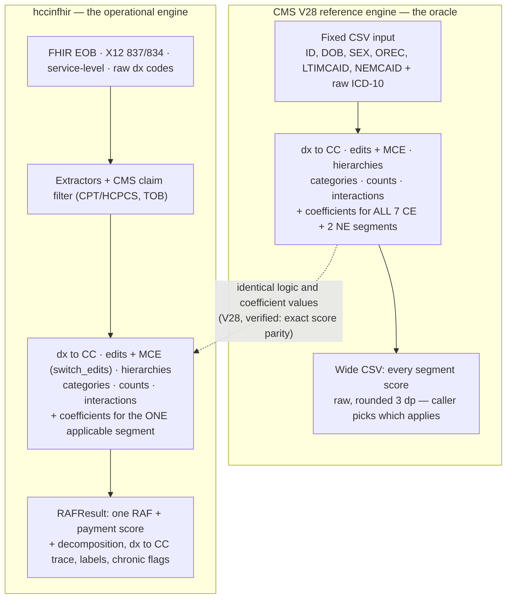
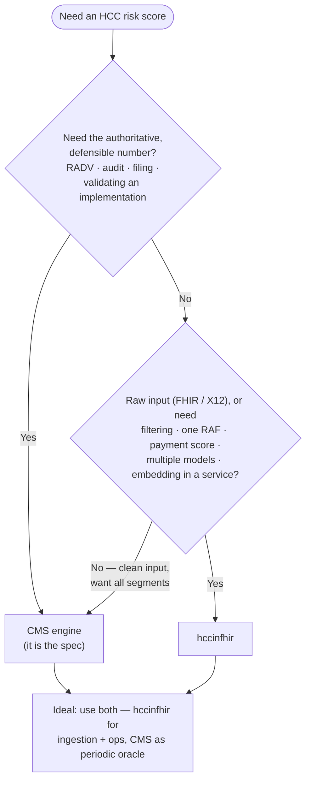

# CMS-HCC V28 — Reference Engine vs. hccinfhir

A component-by-component comparison of the **official CMS-HCC V28 Python package**
(payment year 2027, "T1 initial") against **hccinfhir**'s V28 implementation, plus
guidance on when to use each.

> This is about the **Medicare Advantage** CMS-HCC model. It is **not** the
> ACA/Marketplace HHS-HCC comparison in the top-level `README.md` — that section
> covers a different program and is philosophy-only. This document is CMS-HCC (V28)
> specific and backed by a direct code + data review.

**Scope reviewed:** CMS-HCC V28. V28 is *the* CMS-HCC payment model for 2026–2027,
so it is the right focus. Other models (V22/V24/ESRD/RxHCC) were **not** given the
same deep structural comparison here — see [Not yet verified](#not-yet-verified).

**Sources**
- CMS Python engine: `resources/CMS_HCC_v28_2027_T1_initial_package_v1/`
- CMS SAS edit macro: `resources/sas_edit_macros/V28I0ED3.TXT`
- hccinfhir: `src/hccinfhir/model_*.py`, `src/hccinfhir/data/`

---

## Architecture at a glance

Both tools wrap the **same scoring core** — for V28 the mapping, edits, hierarchies,
categories, interactions, and coefficient values are identical (verified: exact score
parity). They differ in the *shell* around that core: how data gets **in**, whether a
**single segment** is chosen, and what comes **out**.



| | CMS engine | hccinfhir |
|---|---|---|
| **Input** | fixed CSV (structured, pre-adjudicated) | FHIR EOB / X12 837/834 / raw dx |
| **Filtering** | none (assumes clean input) | CMS CPT/HCPCS + TOB filtering built in |
| **Segment** | computes **all 7 CE + 2 NE** | selects **the one** that applies |
| **Output** | wide CSV of raw scores | `RAFResult`: RAF + payment score + trace |
| **Scope** | one model × one year per package | multi-model, multi-year, `prefix_override` |
| **Nature** | authoritative (it *is* the spec) | validated interpretation, built to embed |

---

## When to use which

The two tools are built for **different jobs**, not competing at the same one.

**The CMS engine is a reference implementation of the scoring math** — its job is to
be *definitionally correct* for one model, one payment year:
- File-in / file-out **batch** (pandas); rigid minimal input (`ID, DOB, SEX, OREC,
  LTIMCAID, NEMCAID` + raw ICD-10).
- **Computes every segment for every person** (all 7 CE + 2 NE scores) and returns
  them all — it refuses to choose which applies.
- Ships its own authoritative data inside the package; **one package = one model ×
  one year**.
- Output is **raw relative-factor scores** (3 decimals). No claims filtering, no
  FHIR/X12 ingestion, no payment adjustments, no traceability.

**hccinfhir is a production data-processing library** — its job is to turn messy
real-world data into an actionable, payment-oriented answer per member:
- **Per-beneficiary functional API** (`calculate_raf(...)`), composable, embeddable.
- **Picks the one segment that applies** (`CNA/CFA/INS/NE/DI_/Rx_…`) and returns a
  single RAF plus decomposition (`risk_score_demographics/_hcc/_chronic_only`) and a
  **payment score** (normalization, MACI, frailty).
- **Ingests FHIR EOB / X12 837 / X12 834 / service-level / raw dx**, with CMS claims
  filtering (CPT/HCPCS + TOB) and demographic derivation built in.
- **Multi-model, multi-year** in one package, with data-quality escape hatches
  (`prefix_override`) and traceability (`cc_to_dx`, labels, chronic flags).
- It is an **interpretation** — it *can* drift from CMS, which is why this review
  exists.

One line: **CMS = the oracle** (authoritative, rigid, "here are all the numbers");
**hccinfhir = the operational engine** (flexible ingestion, one opinionated answer,
payment-ready — but validated, not definitional).

### Use the CMS engine when
- You need the **authoritative, defensible** number — RADV/audit, regulatory filing,
  payment disputes. You cannot be "wrong" against the spec.
- You are **validating** another implementation (including hccinfhir).
- Input is already **clean and structured**; you don't need ingestion or filtering.
- You want **every segment's** score and full variable-level transparency.
- Batch, offline, single model-year runs.

### Use hccinfhir when
- You start from **raw data** (FHIR EOB / X12) and need extraction + CMS filtering
  before scoring.
- You want **one payment-oriented answer per member** (RAF + payment score), not nine
  raw scores to post-process.
- You need **multiple models/years** side by side.
- You must handle **data-quality reality** (`prefix_override`, dual/ESRD/LTI
  miscoding).
- You're **embedding scoring in an app/service/pipeline** or doing **prospective**
  work (gap closure, risk capture, what-if).
- You need **traceability and decomposition**.

### They're complementary
The strongest setup uses both: hccinfhir for ingestion + operations + payment logic,
and the CMS engine as the **periodic oracle** to confirm hccinfhir stays
spec-faithful. Two dependencies to manage when relying on hccinfhir: keeping
**coefficients current**, and **re-validating** against each new CMS package.



---

## Component-by-component alignment (V28)

| Component | CMS engine | hccinfhir | Verdict |
|---|---|---|---|
| ICD-10 → CC mapping | mapping file + edit macro | `model_dx_to_cc` + `ra_dx_edits.csv` | ✅ Aligned |
| Age/sex edits (mandatory) | `V28I0ED3` mandatory blocks | `ra_dx_edits.csv` (V28) | ✅ **Exact** — 107 rows = 2 sex + 16 age<18 + 57 breast + 32 newborn |
| MCE edits (`SEDITS`) | age/sex validity formats, toggled | `ra_dx_edits.csv` (`mce_age`) + `switch_edits` param | ✅ Implemented (toggle, default on) |
| CC223 recode | zero unless CC221/222/224/225/226 | `model_hierarchies.py` | ✅ Identical rule |
| CC → HCC hierarchies | `V28_HCC_Hierarchies.csv` | `ra_hierarchies_2026.csv` | ✅ **Exact** — 60 parents / 149 edges, 0 diffs |
| Diagnosis categories | `V28_Diagnosis_Categories.csv` (11) | `get_diagnostic_categories` | ✅ **Exact** — identical HCC membership (cosmetic name diffs only) |
| Interactions | `V28_Interactions.csv` (11) | `create_disease_interactions` | ✅ **Exact** — identical var pairs |
| HCC counts (D1–D10P) | total HCC count | `create_hcc_counts` | ✅ Identical |
| Disabled / orig-disabled | `DISABL`, `ORIGDIS` | `model_demographics.py` | ✅ Match |
| CE age/sex bands (12) | inclusive bands | 12 bands | ✅ Match (age-0 fixed this review) |
| NE age/sex bands (16) + age-64 rule | single-year 65–69, OREC-64 bump | new-enrollee branch | ✅ **Exact** (incl. the age-64 `OREC` rule) |
| NE Medicaid/orig-dis interactions | `NMCAID_*`/`MCAID_*` | `model_interactions` | ✅ Match (NEMCAID source differs: derived vs explicit flag) |
| Scoring structure | all 7 CE + 2 NE columns | selects the one applicable segment | ✅ Equivalent (ours = CMS's matching column) |
| Coefficient **values** | `V28_CE/NE_Relative_Factors` | `ra_coefficients_2026` (C28) | ✅ **Checksum-identical** (default set; the opt-in *proposed* 2027 file differs by design) |

**Bottom line:** for the scored Medicare population, hccinfhir's V28 **logic,
structure, coefficient values, and edits (including MCE) are CMS-identical**, verified
by exact numeric parity across community/institutional segments and a pediatric
(MCE-exercising) beneficiary.

---

## Findings

### Resolved this review
- **Age-0 categorization bug** — the V2/V4 age-band loop excluded age exactly 0 and
  raised `ValueError` (reachable for ESRD-model infants). Fixed (`(0,34)`→`(-1,34)`)
  with a regression test.
- *(Cross-model, beyond V28)* `ra_dx_edits.csv` was V28-only; rebuilt from the CMS
  SAS macros to cover V22/V24/ESRD as well. V28 rows verified **byte-identical** to
  the prior hand-curated set.
- **Coefficient values — verified matching, not a divergence.** The default
  `ra_coefficients_2026.csv` C28 rows are **checksum-identical** to CMS's V28 factors
  (n=1237, sum=1194.018, avg=0.96525, min=0, max=32.199 — same in the CMS package,
  in mimilabs `ra_coefficients` model `C2824T2N`, and in our file). V28 uses a single
  factor set effective **2024–2027**, so there is no separate "2027 final" set to
  chase. The only file that differs is the opt-in `ra_proposed_coefficients_2027.csv`,
  which holds *Advance-Notice proposed* values **by design** — not the payment set.
- **MCE edits — implemented.** The Medicare Code Editor age-validity edits
  (`V28I0ED3`'s `%IF &SEDITS` block; 303 codes) are now ported as `mce_age` rows in
  `ra_dx_edits.csv`, gated by a `switch_edits` parameter (default `True`, matching the
  CMS default) on `calculate_raf` and `HCCInFHIR`. Source: the V28 package's resolved
  `MCE_AGE_CONDITION` column. Verified by numeric parity on a pediatric beneficiary
  (below). **MCE is model-independent** across the CMS-HCC/ESRD family — V22/V24/V28/
  ESRD V21/V24 all load the same `IAGEHYBCY25MCE`/`ISEXHYBCY25MCE` format, so these
  rules apply to those models too (currently emitted for V28, since the readable
  source is V28-scoped); **RxHCC V08 uses a different variant** (`I0…`) and is not
  covered. MCE sex-validity is a non-issue for V28 payment codes (only D66/D67, already
  handled as mandatory sex edits).

### Numeric parity — verified
Ran the CMS V28 engine and hccinfhir on the same synthetic beneficiaries and diffed
HCC lists **and** scores. **Exact match** (Δ = 0.000) across segments:

| Bene | Segment | HCCs | CMS | ours |
|---|---|---|---|---|
| aged non-dual | CNA | ✅ | 2.007 | 2.007 |
| aged full-dual | CFA | ✅ | 2.583 | 2.583 |
| disabled | CND | ✅ | 1.827 | 1.827 |
| aged, orig-disabled | CNA | ✅ | 2.170 | 2.170 |
| young disabled (age<50) | CND | ✅ | 2.017 | 2.017 |
| pediatric disabled (age 10) | CND | ✅ | 1.128 | 1.128 |

This exercises mapping + edits (incl. the C50 age split — the young bene gets CC22,
others CC23), **MCE** (the pediatric bene's `age ≥ 15` codes are invalidated on both
engines), hierarchies, diagnosis categories + interactions (`DIABETES_HF`,
`HF_CHR_LUNG`, `DISABLED_*`), demographic segments, and coefficient values together.
Reproduce with `resources/parity_harness/run_parity.py`.

> Parity was run with the CMS engine's default `switch_edits=True`, and hccinfhir now
> implements MCE (also default on), so parity holds for **both** adult and pediatric
> beneficiaries. **Do not use the CMS engine's `switch_edits=False` — it is broken
> (see below).**

### Confirmed bug in the CMS V28 Python engine (`switch_edits=False`)

Running the CMS-published V28 **Python** package with `switch_edits=False` produces
**zero HCCs for every beneficiary** — every score collapses to the demographic
(age/sex) term. This is a **bug**, verified below, not an intended behavior.

**Where:** `common/CMS_HCC_utils.py`, `get_bene_diagnosis_ccs`. `cc_ids_list` is a
list of CC *column names* (strings: `'CC17'`, `'CC37'`, …). The mapped CC exists as
both `model_cc` (int `37`) and `cc_col_name` (str `'CC37'`). The two branches end with
different guards:

```python
if switch_edits:                     # default (correct)
    ...
    if cc_col_name in cc_ids_list:   # 'CC37' in [...]  -> True  ✓
        bene_info_cc_init_df.loc[..., cc_col_name] = 1
else:                                # buggy
    ...
    if model_cc in cc_ids_list:      # 37 in [...]      -> always False ✗
        bene_info_cc_init_df.loc[..., cc_col_name] = 1
```

`37 in ['CC17','CC37', …]` is always `False` (int vs. strings), so the flag is never
set. **One-line fix:** make the `else` branch use `cc_col_name` (like the `if` branch).

**Why it's a bug, not a feature (verified):**
- The `else` branch *contains* the flag-assignment line and an *identical* comment to
  the working branch — it clearly intends to set CCs.
- Applying only that one-line fix makes `switch_edits=False` produce **identical HCCs**
  to `switch_edits=True` for adult beneficiaries (the sole intended difference is MCE,
  which doesn't affect age ≥ 15). Confirmed across all parity beneficiaries.
- Documented semantics say `switch_edits` toggles *MCE age criteria*, not whether
  mapping happens at all.

**Why it's insidious:** it fails silently (no error; plausible demographic-only
scores), and the intermediate tracking table `bene_diagnosis_cc_df` still populates —
so it *looks* like diagnoses were processed. The working default (`True`) masks it.

**Scope:** the CMS **Python** V28 package specifically (a porting artifact; the SAS
macros are unaffected). Trivial, unambiguous fix — reportable to CMS.

### Not yet verified
- **Only V28 got the deep structural comparison.** For V22/V24/ESRD/RxHCC only the
  edit macros were compared; their hierarchies, categories, and interactions were not
  cross-checked against CMS packages (which are now available in `~/Downloads`).

### Methodology note (why the SAS macro is the edit authority)
Early on, `P041`/`P048` looked like "stray" edits because they're absent from the
package's **mapping CSV** — but that CSV is "payment HCCs only" and drops codes that
map to no CC. The **SAS edit macro** (`V28I0ED3`) *does* list them (newborn `age ≥ 2`
→ invalid). Lesson: treat the **edit macro**, not the mapping CSV, as the source of
truth for edits.

---

## How to re-validate against a future CMS package

1. Drop the new CMS-HCC V28 package under `resources/` (and the SAS edit macro under
   `resources/sas_edit_macros/`).
2. Re-run the structural diffs: hierarchies (parent→child edges), diagnosis
   categories, interactions — expect exact matches unless CMS changed the model.
3. Rebuild edits: `python resources/sas_edit_macros/build_ra_dx_edits.py`, then
   confirm the V28 subset is unchanged (or reconcile intended changes).
4. Refresh coefficients from `V28_CE/NE_Relative_Factors.csv` if adopting that year.
5. Run the numeric parity harness and diff HCCs + scores:
   `CMS_PYTHON=<python-with-pandas> hatch run python resources/parity_harness/run_parity.py`
